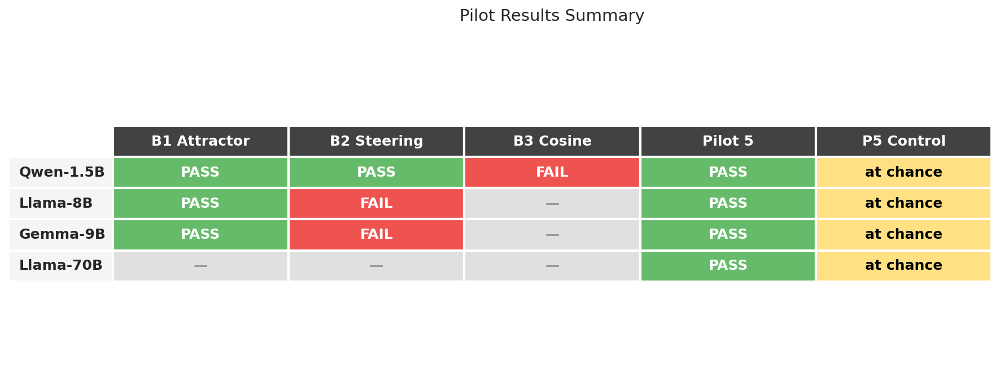
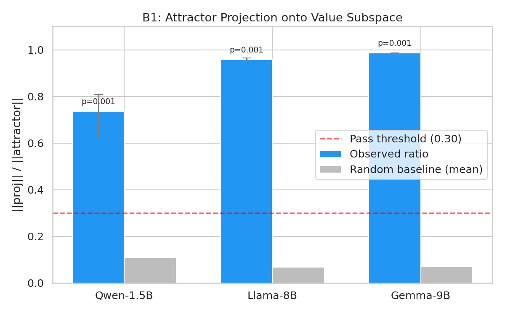
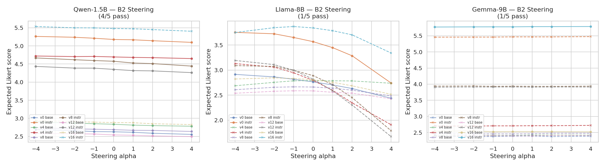
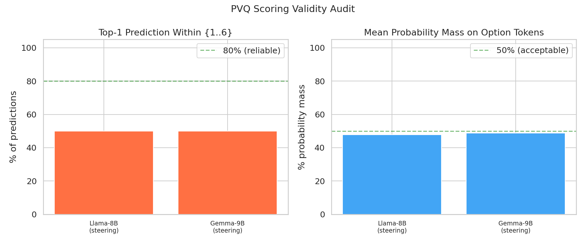
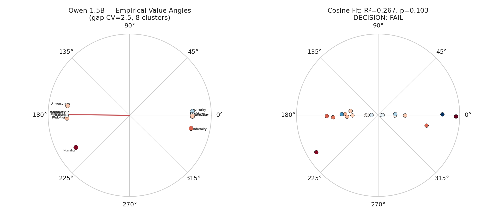
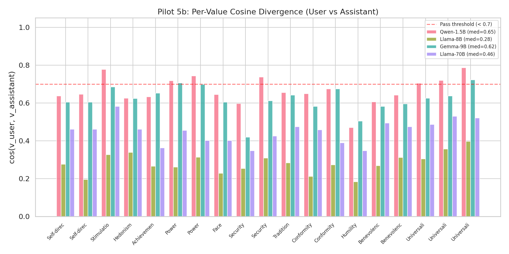

# value_mech

**Mechanistic interpretability of human values in large language models**

Do LLMs encode human values as geometric structure in their residual stream? This project investigates whether instruction-tuned models develop an interpretable *value subspace* aligned with [Schwartz's circumplex theory](https://doi.org/10.1016/j.jrp.2012.01.006) of 19 universal human values — and whether that structure can be causally steered.

## Research Questions

1. **Attractor geometry** — When an LLM is instruction-tuned, does the resulting behavioral shift (the "compliance attractor") live inside the value subspace, or is it orthogonal to it?
2. **Steering inertia** — Do base and instruct models respond differently to value-steering interventions? Does instruction tuning create measurable *resistance* to value manipulation?
3. **Circumplex law** — Does the inertia pattern follow a smooth cosine curve around the Schwartz circumplex, suggesting a mechanistic (not ad-hoc) alignment structure?
4. **Agent modeling** — Can the residual stream distinguish between values *attributed to the user* vs. *demonstrated by the assistant* in dialogue?

## Results

I ran the full gated pilot pipeline across four model families (Qwen-1.5B, Llama-3.1-8B, Gemma-2-9B, Llama-3.1-70B). Key findings:

### Summary



### B1: Attractor Projection (PASS — replicates across all models)



The compliance attractor (the direction in which instruction tuning moves the residual stream) projects **strongly** onto the 19-dimensional Schwartz value subspace. This is the strongest finding: it replicates across all three base/instruct pairs (p < 0.001 against a random-direction null in all cases), and the effect *increases with model scale* (Spearman rho = 1.0 across 1.5B, 8B, 9B).

| Model | Projection ratio | Random null mean | p-value |
|-------|-----------------|-----------------|---------|
| Qwen-1.5B | 0.736 | 0.109 | < 0.001 |
| Llama-3.1-8B | 0.959 | 0.067 | < 0.001 |
| Gemma-2-9B | 0.987 | 0.071 | < 0.001 |

**Interpretation:** Instruction tuning moves the model predominantly *within* the value subspace, not orthogonal to it. The attractor is not a generic "compliance" direction — it is value-laden by construction.

### B2: Steering Slopes (mixed — measurement validity issue)



Qwen-1.5B passes B2 (4/5 pilot values show significantly different steering slopes between base and instruct after Holm-Bonferroni correction). However, Llama-8B and Gemma-9B both fail (1/5).

The **PVQ scoring audit** reveals why: only 50% of larger models' top-1 predictions fall within the {1..6} Likert option set. The models often predict other tokens (spaces, pronouns, etc.), and the score is computed from a renormalized distribution over just the option tokens — effectively noise.



**Interpretation:** The failure is a measurement problem, not a negative finding about steering. The PVQ logit-based scoring method works for small models (Qwen-1.5B) but breaks down for larger models that are less constrained in their next-token predictions. This motivates redesigning the scoring method (see [Next Steps](#next-steps)).

### B3: Cosine Law (FAIL — circumplex structure absent)



The cosine-law hypothesis fails on Qwen-1.5B (R² = 0.267, permutation p = 0.103 > 0.05 threshold). Diagnostic analysis reveals why: the empirical value angles from PCA collapse into **8 clusters** (gap CV = 2.45) rather than the 19 uniformly-spaced points the circumplex predicts. The circumplex geometry simply does not appear in this model's value representations.

B3 was skipped for Llama-8B and Gemma-9B because it is gated behind B2, which failed for those models.

### Pilot 5: User vs. Assistant Value Encoding



Test 5a (linear probe) achieves 1.0 accuracy across all four models at distinguishing user-attributed vs. assistant-demonstrated values. However, the **shuffled-speaker control** drops accuracy to chance (~0.51) in all cases, confirming that the probe detects **chat-template positional features**, not genuine semantic content.

Test 5b (per-value cosine divergence) is the substantive test. It shows that value vectors computed from user-position vs. assistant-position activations diverge meaningfully (median cosine < 0.7 in all models). Llama-8B shows the strongest divergence (median cos = 0.276), suggesting larger models may encode speaker-role context more strongly into value representations.

| Model | Probe accuracy | Median cos(user, asst) | Shuffle control |
|-------|---------------|----------------------|----------------|
| Qwen-1.5B | 1.00 | 0.649 | at chance (0.521) |
| Llama-3.1-8B | 1.00 | 0.276 | at chance (0.512) |
| Gemma-2-9B | 1.00 | 0.624 | at chance (0.511) |
| Llama-3.1-70B | 1.00 | 0.461 | at chance (0.530) |

## Next Steps

Based on these results, I identify three directions for follow-up work:

### 1. Fix the PVQ scoring method for larger models

The B2 failure at scale is a measurement problem, not a null result. The logit-based PVQ scoring assumes models place high probability on digit tokens {1..6}, which breaks for larger instruction-tuned models. Options:
- **Generation-based scoring**: Generate a full response and parse the digit from it, rather than using next-token logits
- **Forced-choice format**: Use a multiple-choice prompt ("A) Strongly disagree ... F) Strongly agree") that larger models are trained to follow
- **Embedding-based scoring**: Skip Likert scales entirely; measure steering effects via cosine similarity in the value subspace rather than behavioral PVQ scores

### 2. Move beyond the circumplex framing

B3's failure is not just statistical — the angle diagnostics show the circumplex structure is fundamentally absent in these models' geometry. The 19 values do not arrange themselves in a ring. However, B1's strong result shows the value subspace *does* exist and is meaningful. Future work should:
- Investigate what structure the value subspace *does* have (e.g., hierarchical clustering, factor structure)
- Test whether Schwartz's higher-order quadrants (Openness, Conservation, Self-Enhancement, Self-Transcendence) form a more coarse-grained geometry
- Use representational similarity analysis (RSA) to compare the model's value geometry to the theoretical circumplex without assuming it should be circular

### 3. Disentangle positional and semantic signals in Pilot 5

The probe's 1.0 accuracy is entirely positional (chat-template features), but Test 5b's cosine divergence suggests real value-speaker encoding exists underneath. To isolate it:
- **Causal intervention**: Steer in the user-value direction while the model is in assistant mode, and measure whether the model's behavior shifts toward user-like value expression
- **Cross-position probing**: Train the probe on activations from one template format and test on another (e.g., train on Llama chat template, test on Qwen)
- **Content-controlled dialogues**: Use longer, more realistic dialogues where the same value appears in both positions within a single conversation

## Method

### Pipeline Architecture

```
ValueEval24 Dataset
        |
        v
  Difference-in-Means ──> 19 Value Vectors (per model)
        |
        ├──> B1: Attractor Projection ── PASS? ──> B2: Steering Slopes ── PASS? ──> B3: Cosine Law
        |                                                                              (full 19-value
        |                                                                               inertia fit)
        └──> Pilot 5: Self/Other Probe (independent)
              └──> Pilot 5 Control: Shuffled-Speaker Null
```

The B-track is a **gated pipeline** — each stage must pass a pre-committed decision rule before the next stage runs. This prevents post-hoc threshold tuning: if a pilot fails, I document the failure and pivot.

### Pilot Experiments

| Pilot | Question | Method | Pass criterion |
|-------|----------|--------|----------------|
| **B1** | Is the attractor inside the value subspace? | Project attractor onto 19-D value basis; bootstrap CI on norm ratio; random baseline null | ratio >= 0.30, CI lower >= 0.20 |
| **B2** | Do steering slopes differ between base/instruct? | Sweep alpha in [-4, 4]; fit linear slopes; Holm-Bonferroni-corrected bootstrap | >= 3/5 values: monotone + corrected CI excludes 0 |
| **B3** | Does inertia follow a cosine law? | Fit inertia(theta) = A*cos(theta - phi) + C; permutation null; angle distribution diagnostics | R^2 > 0, permutation p < 0.05 |
| **5** | Can the model separate user vs. assistant values? | Logistic probe on residual activations; per-value cosine divergence | accuracy > 0.70, median cosine < 0.70 |
| **5-control** | Is the probe signal positional? | Shuffle speaker labels; rerun probe and cosine analysis | Disambiguates positional vs. semantic |

### Red-Team Controls (added post-pilot)

| Control | What it tests | Finding |
|---------|---------------|---------|
| Random baseline (B1) | Would a random direction project this strongly? | No — observed ratio 7-14x above random null (p < 0.001) |
| Holm-Bonferroni (B2) | Are results inflated by multiple comparisons? | Correction preserves Qwen results (4/5 still pass) |
| Angle diagnostics (B3) | Is the circumplex structure present? | No — values cluster into 8 poles, not 19 uniformly-spaced points |
| PVQ audit (B2/B3) | Are PVQ scores meaningful? | Only 50% for larger models — scoring method needs redesign |
| Shuffled-speaker (P5) | Is the probe detecting position or content? | Position — accuracy drops to chance under label shuffle |

### Technical Approach

- **Value vectors**: Extracted via difference-in-means on [ValueEval24](https://touche.webis.de/clef24/touche24-web/value-identification.html) sentences, balanced positive/negative sampling with same-quadrant confound removal
- **Steering**: Activation injection at a pre-committed mid-layer — unit-normalized value vectors scaled by alpha, added to the residual stream via forward hooks
- **Scoring**: PVQ-style Likert items scored via next-token log-probabilities over option tokens, with preamble paraphrase variance reduction and logit audit
- **Statistics**: Bootstrap CIs (n=1000), permutation nulls (n=1000), Spearman monotonicity, cosine-fit R^2, Holm-Bonferroni correction, circular variance diagnostics

## Supported Models

| Model family | Parameters | GPUs needed | Status |
|-------------|-----------|-------------|--------|
| Qwen2.5 | 1.5B | 1 | Full pipeline complete |
| Llama 3.1 | 8B | 2 | B1 + B2 + Pilot 5 complete |
| Gemma 2 | 9B | 2 | B1 + B2 + Pilot 5 complete |
| Gemma 2 | 27B | 4 | In progress |
| Llama 3.1 | 70B | 6 | Pilot 5 only (complete) |

All models run in bfloat16 with multi-GPU sharding via `device_map="auto"` when needed.

## Quick Start

```bash
# Create environment
conda create -n value_mech python=3.11 -y
conda activate value_mech
pip install -r requirements.txt

# Prepare data
unzip valueeval24.zip -d /tmp

# Run unit tests (no GPU required)
python tests/test_all.py

# Run pilot on single GPU (Qwen2.5-1.5B, ~20 min)
CUDA_VISIBLE_DEVICES=0 bash scripts/run_gated.sh

# Generate analysis figures from results
python scripts/analyze_results.py
```

Results are written to `outputs/<pilot_name>/results.json`. Figures are written to `figures/`.

### Multi-GPU / Multi-Model

```bash
# Set HuggingFace token for gated models (Llama, Gemma)
export HF_TOKEN=hf_xxxxx

# Run all models in parallel across 8 GPUs
nohup bash scripts/launch_all_nohup.sh > logs/master.out 2>&1 &

# Monitor progress
tail -f logs/llama8.err
tail -f logs/gemma9.err

# Resume a killed run (checkpoints pick up automatically)
bash scripts/launch_all_nohup.sh
```

## Reproducibility Controls

| Concern | Control |
|---------|---------|
| Determinism | Single global seed, `torch.use_deterministic_algorithms`, cuDNN deterministic |
| Tokenizer parity | Asserted identical between base and instruct |
| Layer selection | Pre-committed per model family — never post-hoc |
| Sample balance | Identical N for positive/negative; same sentences for both models |
| Resumability | Atomic `.npy` writes + append-only JSONL with fsync — survives SIGKILL/OOM |
| Statistical rigor | Pre-committed thresholds; bootstrap CIs; permutation nulls; Holm-Bonferroni; calibration tested in unit tests |
| Measurement audit | PVQ logit audit tracks top-1 in-option rate and probability mass per model |

## Project Structure

```
value_mech/
├── config.yaml                  # Hyperparameters and GPU allocation
├── requirements.txt
├── src/
│   ├── data.py                  # Schwartz circumplex, ValueEval24 loader, PVQ items
│   ├── models.py                # Multi-GPU model loading, residual extraction
│   ├── vectors.py               # Value vectors, attractor, subspace projection
│   ├── steering.py              # Activation steering hooks, PVQ scoring + audit
│   ├── stats.py                 # Bootstrap, permutation tests, cosine fitting,
│   │                            #   Holm-Bonferroni, circular diagnostics
│   ├── checkpoint.py            # Crash-safe JSONL + atomic .npy checkpoints
│   ├── utils.py                 # Seeding, config loading, logging
│   ├── pilot_b1_attractor.py    # Attractor projection test + random baseline
│   ├── pilot_b2_steering.py     # Steering slope comparison + Holm correction
│   ├── pilot_b3_gradient.py     # Full circumplex inertia fit + angle diagnostics
│   ├── pilot_5_self_other.py    # User vs. assistant value encoding
│   └── pilot_5_control.py       # Shuffled-speaker null
├── scripts/
│   ├── run_gated.sh             # Gated pipeline runner
│   ├── launch_nohup.sh          # Single-model launcher
│   ├── launch_all_nohup.sh      # Multi-model parallel launcher (8 GPUs)
│   └── analyze_results.py       # Cross-model analysis and figure generation
├── tests/
│   └── test_all.py              # Unit tests (18 tests, math + statistics + steering)
├── configs/                     # Per-model YAML configs
└── figures/                     # Generated plots (by analyze_results.py)
```

## License

Research use only.
